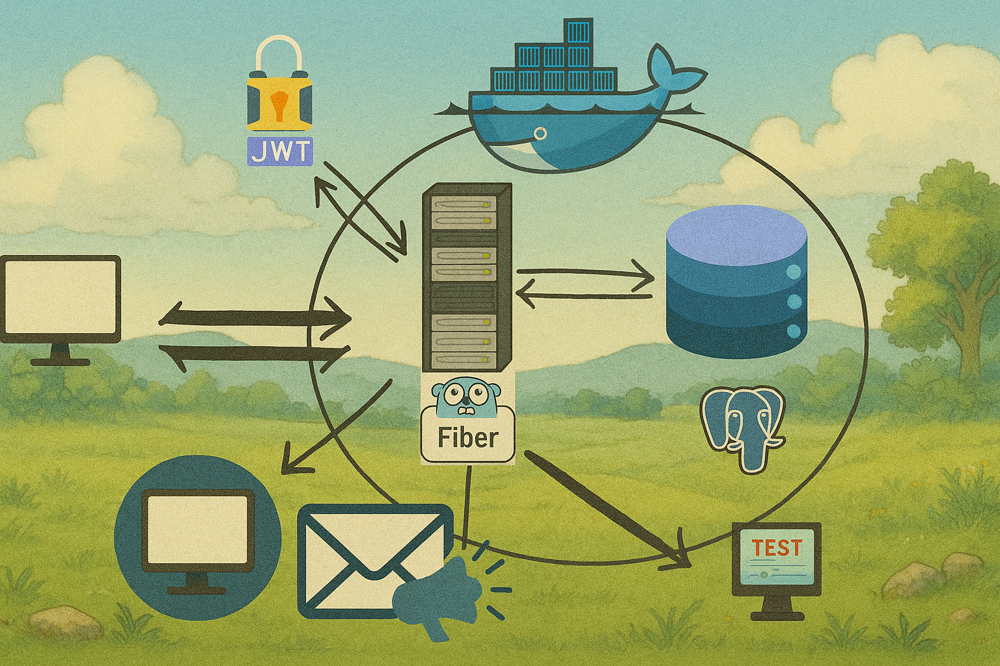

<br />
<div align="center">
  <a href="https://github.com/muhammedkucukaslan/advanced-todo-api">
    
  </a>

[![Golang][Golang.com]][Golang-url]
[![Fiber][Fiber.io]][Fiber-url]
[![PostgreSQL][PostgreSQL.com]][PostgreSQL-url]
[![Docker][Docker.com]][Docker-url]
[![JWT][JWT.io]][JWT-url]
[![Testify][Testify.com]][Testify-url]
[![Swagger][Swagger.io]][Swagger-url]
[![Validator][Validator.com]][Validator-url]
[![Slog][Slog.com]][Slog-url]


<h1 align="center">Advanced Todo API</h1>
  <p align="center">
    A RESTful API for managing todos with advanced features.
  </p>
</div>


<details>
  <summary>Table of Contents</summary>
  <ol>
    <li>
      <a href="#about-the-project">About The Project</a>
      <ul>
        <li><a href="#tech-stack">Tech Stack</a></li>
        <li><a href="#features">Features</a></li>
      </ul>
    </li>
    <li>
      <a href="#getting-started">Getting Started</a>
      <ul>
        <li><a href="#prerequisites">Prerequisites</a></li>
        <li><a href="#installation">Installation</a></li>
        <li><a href="#api-usage">API Usage</a></li>
      </ul>
    </li>
    <li><a href="#testing">Testing</a></li>
    <li><a href="#contributing">Contributing</a></li>
  </ol>
</details>


## About The Project

As a Backend Developer, I am trying to build robust and scalable API projects by writing clean and maintainable code. It's been hard to learn **advanced** concepts at first, esspecially working on a real-world project. So, I decided to build a project that includes advanced features and concepts but also has a simple business logic such as Todo Management. This project is the result of this desire. 


### Features
- 🛡️ Secure RESTful API
- ⚙️ Onion Architecture
- ✅ JWT-based Authentication
- 🔒 Role-based Access Control
- 🗂️ Account Managing
- 👤 User Management
  - 📌 Create, Read, Update, Delete (CRUD)
  - 🔁 Forgot Password & Reset Password
  - 📧 Email Verification
- 📌 Todo CRUD (Create, Read, Update, Delete)
- 🧱 Database Migrations for Initializing the Application and Test Environments
- 🧪 Unit & Integration & Http & E2E Tests with Testify and Test Containers
- 🧾 Swagger-based API Documentation
- 🐳 Docker Support via `docker-compose`
- 📤 Email Notification Integration

### Tech Stack
[Golang][Golang-url] [Fiber][Fiber-url], [PostgreSQL][PostgreSQL-url], [Docker][Docker-url], [JWT][JWT-url], [Testify][Testify-url], [Swagger][Swagger-url], [Validator][Validator.com], [Slog][Slog.com]

## Getting Started

Follow these steps to get the project up and running on your local machine.

### Prerequisites

* Go 1.23 or later
  ```sh
    sudo apt install golang
  ```
* Docker and Docker Compose
  ```sh
    sudo apt install docker.io docker-compose
  ```

### Installation

1. Clone the repo
   ```sh
   git clone https://github.com/muhammedkucukaslan/advanced-todo-api.git
   ```
2. Change directory to the project folder
   ```sh
   cd advanced-todo-api
   ```
3. Configure the environment variables
   Create a `.env` file in the root directory and add the following variables:
   ```sh
    touch .env
   ```
    Then add the following content to the `.env` file:
    ```sh
    DATABASE_URL="host=db user=postgres password=password123 dbname=advanced_todo_api_db port=5432 sslmode=disable"
    JWT_SECRET="your_jwt_secret"
    MAILERSEND_API_KEY="your-api-key"
    MAILERSEND_SENDER_EMAIL="sender@sender_domain.com"
    MAILERSEND_SENDER_NAME="sender_name"
   ```
4. Run the application. You can use Docker or directly with Go.

   **Using Docker:**
   ```sh
   docker-compose up --build
   ```

   **Using Go:**
   ```sh
   go run cmd/main.go
   ```
    > ⚠️**Note:** If you are **not** using Docker, make sure you have a running PostgreSQL database on your machine and that your `.env` file is configured with the correct database connection details.

   If you are able to use Makefile, you can also run the following command to start the application:
   
   **Using Docker:**
   ```sh
   make compose
   ```

   **Using Go:**
   ```sh
   make run
   ```


### API Usage

You can explore and test the API manually using the automatically generated Swagger UI.
#### 🔄 Generate Swagger Docs

If you've made changes to your API, regenerate the Swagger documentation:

```sh
make swagger
```
#### 🚀 Start the Application

Use Docker to start the app:

```sh
make compose
```
####  🌐 Access Swagger UI

```sh
http://localhost:3000/swagger/index.html
```
From there, you can:
  - View all available endpoints
  - Send test requests
  - See required request bodies and response formats

> You can only access swagger document endpoint when `ENV` environment is not `production`

## Testing
You can run the tests by using Makefile:
```sh
make test
```
You  can also run each test type separately:
```sh
make unit-test
```
> ⚠️ **Note:** Make sure Docker is installed and running on your machine. Testcontainers require Docker to create isolated environments during below testing.
```sh
make integration-test
make http-test
make e2e-test
```

## Contributing

Contributions are what make the open source community such an amazing place to learn, inspire, and create. Any contributions you make are **greatly appreciated**.

If you have a suggestion that would make this better, please fork the repo and create a pull request. You can also simply open an issue with the tag "enhancement".
Don't forget to give the project a star! Thanks again!

1. Fork the Project
2. Create your Feature Branch (`git checkout -b feature/AmazingFeature`)
3. Commit your Changes (`git commit -m 'Add some AmazingFeature'`)
4. Push to the Branch (`git push origin feature/AmazingFeature`)
5. Open a Pull Request


## 🙋‍♂️ Contact

* [LinkedIn](https://www.linkedin.com/in/muhammedkucukaslan)  
* [GitHub](https://github.com/muhammedkucukaslan)
* [Medium](https://medium.com/@muhammedkucukaslan)


<!-- MARKDOWN LINKS & IMAGES -->
[Golang.com]: https://img.shields.io/badge/Go-00ADD8?style=for-the-badge&logo=go&logoColor=white
[Golang-url]: https://golang.org/

[PostgreSQL.com]: https://img.shields.io/badge/PostgreSQL-4169E1?style=for-the-badge&logo=postgresql&logoColor=white
[PostgreSQL-url]: https://www.postgresql.org/

[Docker.com]: https://img.shields.io/badge/Docker-2496ED?style=for-the-badge&logo=docker&logoColor=white
[Docker-url]: https://www.docker.com/

[Fiber.io]: https://img.shields.io/badge/Fiber-18A5D6?style=for-the-badge&logo=fiber&logoColor=white
[Fiber-url]: https://gofiber.io/

[Swagger.io]: https://img.shields.io/badge/Swagger-85EA2D?style=for-the-badge&logo=swagger&logoColor=black
[Swagger-url]: https://swagger.io/

[Testify.com]: https://img.shields.io/badge/Testify-00BFA6?style=for-the-badge&logo=go&logoColor=white
[Testify-url]: https://github.com/stretchr/testify

[JWT.io]: https://img.shields.io/badge/JWT-000000?style=for-the-badge&logo=JSON%20web%20tokens&logoColor=white
[JWT-url]: https://jwt.io/

[Validator.com]: https://img.shields.io/badge/Validator-v10-blue?style=for-the-badge&logo=go&logoColor=white
[Validator-url]: https://pkg.go.dev/github.com/go-playground/validator/v10

[Slog.com]: https://img.shields.io/badge/log%2Fslog-Go%20Logger-informational?style=for-the-badge&logo=go&logoColor=white
[Slog-url]: https://pkg.go.dev/log/slog
